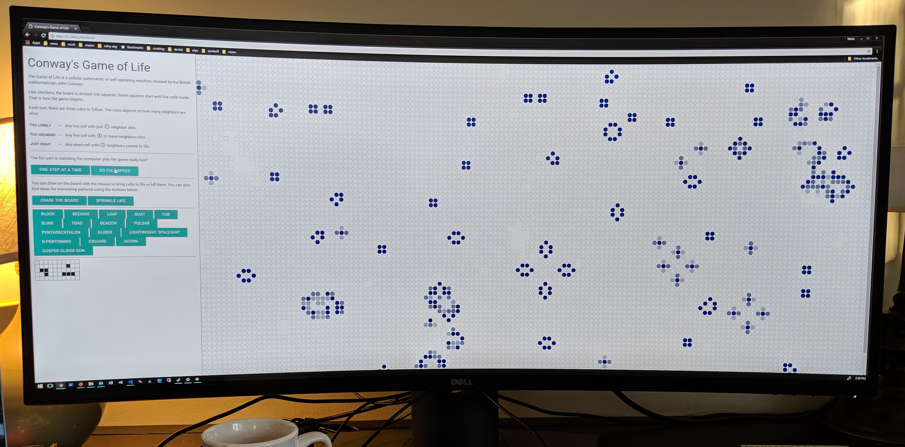

# Conway's Game of Life

I created this simple interactive activity and accompanying worksheet for the 2017 Day of Code at Dora L. Small school in South Portland, ME. 

For a description of Conway's Game of Life and cellular automata in general, see https://en.wikipedia.org/wiki/Conway%27s_Game_of_Life.

## Preview

## Instructions

* Clear the board and leave it paused while students gather around the monitor.
* Explain the 3 rules. Relate them to underpopulation and overpopulation of human and animal communities.
* Demonstrate each rule in turn, by drawing a simple pattern with the mouse and advancing the simulation one step. Students predict the outcome before advancing.
* Use the "sprinkle life" button to scatter live cells randomly around the board. Students make predictions about how many will survive. Keep sprinkling life until the students vote to stop.
* Run the simulation full speed and watch it animate. Ask if the outcome matches their predictions.
* Have students design their own patterns using the worksheets and predict the outcomes.
* Let students use the computer in small groups testing the patterns they created, and experimenting with the example patterns. Motivated students should be able to create a working "Gosper's glider gun".

## Code

The activity is written in simple HTML and JavaScript. Advanced students might like to try changing the color of the dots, or altering the rules. How does it change if some of the rules are disabled?
